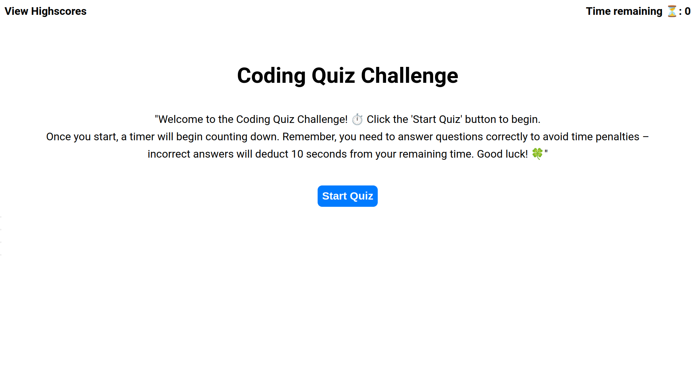
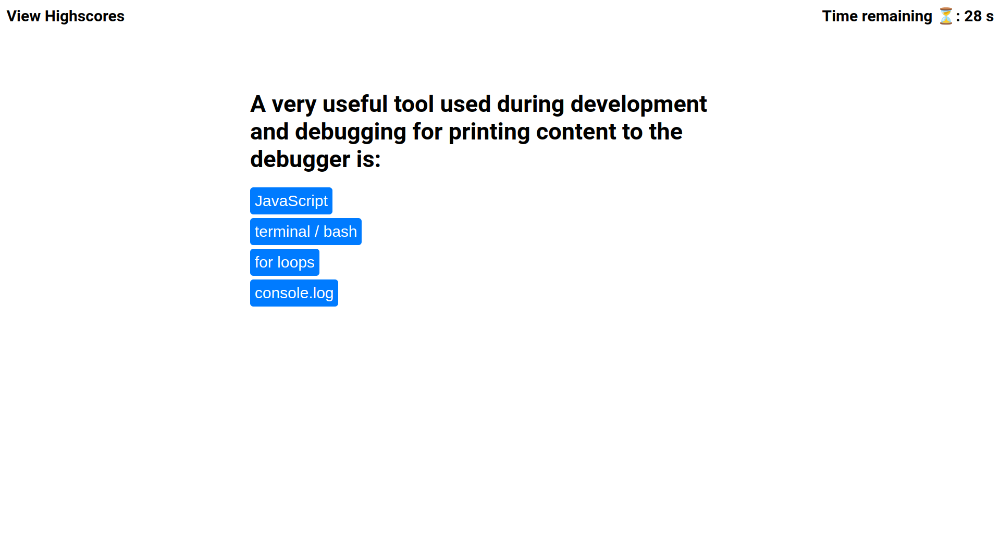
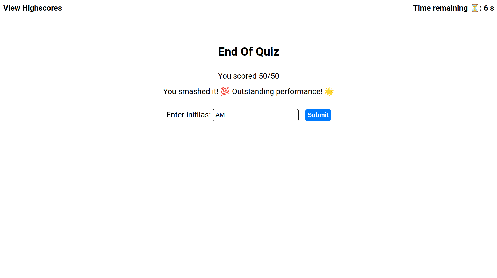
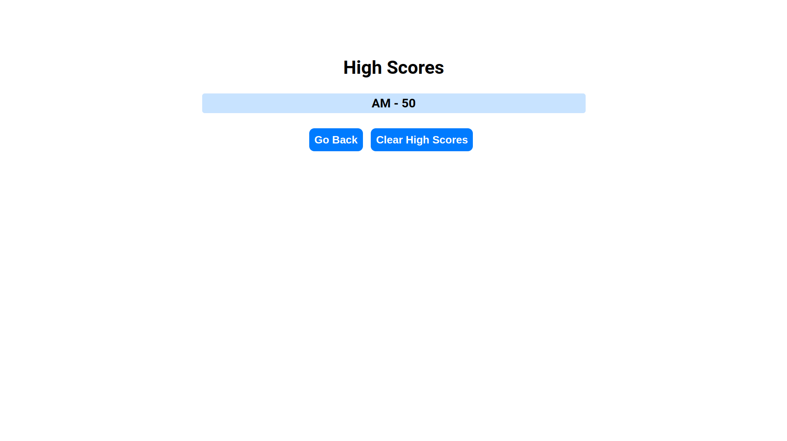

# 04 Web APIs: Code Quiz

## Project Overview

The goal of this project is to build a timed coding quiz with multiple choice questions. The quiz is implemented using HTML, CSS, and JavaScript, providing a clean, polished, and responsive user interface.

## Live Demo

To visit the live website, <a href="">click here</a>

## Key Features And Accomplishments

- **Interactive Quiz Experience:** Users can engage in a timed code quiz by clicking the start button, initiating a countdown timer, and presenting a series of questions one after another.

- **Immediate Feedback:** When users answer a question incorrectly, time is deducted from the countdown clock, as well as an incorrect sound effect is played, providing immediate feedback on their performance.

- **Game Over Conditions:** The quiz ends either when all questions are answered or when the timer reaches zero, ensuring that users have a clear indication of when the game concludes.

- **Score Saving Functionality:** Upon completion of the quiz, users are prompted to save their initials and their score, allowing them to track their performance and compete with others.

## Website Preview

